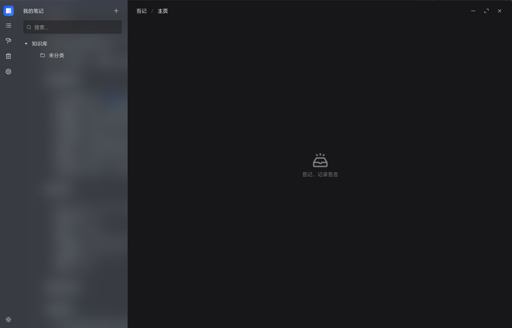
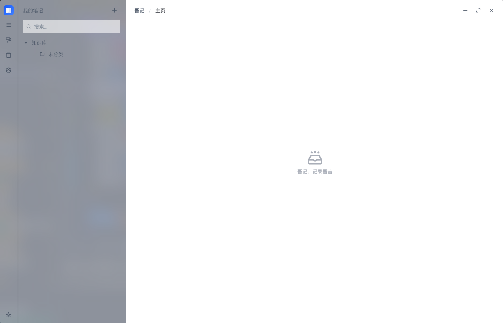

# WuJiNote

WuJiNote is a powerful, local-first note-taking application built with Electron and Vue 3. It features a rich text editor, robust local database storage, and a modern user interface.

[中文文档](#wujinote-中文说明)

<p align="center">
  
</p>

## Screenshots

| Light | Dark |
| --- | --- |
|  |  |

## Features

- **Rich Text Editing**: Powered by [Tiptap](https://tiptap.dev/), supporting headings, lists, code blocks, tables, images, and more.
- **Slash Commands**: Quickly insert blocks and format text using `/` commands.
- **Drag & Drop**: Easily rearrange blocks and manage content.
- **Local Storage**: Your data is stored locally using SQLite (`better-sqlite3`), ensuring privacy and offline access.
- **Export Options**: Export your notes to Markdown or DOCX formats.
- **Recycle Bin**: Safely restore deleted notes.
- **Modern UI**: Built with Arco Design Vue for a clean and responsive interface.
- **Collaboration Ready**: Integrated with Yjs for potential future real-time collaboration features.

## Tech Stack

- **Core**: Electron, Vue 3, Vite (Electron-Vite)
- **State Management**: Pinia
- **Router**: Vue Router
- **Database**: SQLite (better-sqlite3)
- **UI Component Library**: Arco Design Vue
- **Editor**: Tiptap
- **Styling**: SCSS

## Recommended IDE Setup

- [VSCode](https://code.visualstudio.com/) + [ESLint](https://marketplace.visualstudio.com/items?itemName=dbaeumer.vscode-eslint) + [Prettier](https://marketplace.visualstudio.com/items?itemName=esbenp.prettier-vscode) + [Volar](https://marketplace.visualstudio.com/items?itemName=Vue.volar)

## Getting Started

### Prerequisites

- Node.js (Recommended: Latest LTS)
- Yarn

### Installation

1.  Clone the repository:
    ```bash
    git clone https://github.com/CGh0st/WuJiNote.git
    cd WuJiNote-Electron-APP
    ```

2.  Install dependencies:
    ```bash
    yarn install
    ```
    *Note: If you encounter issues with native dependencies (like `better-sqlite3`), try running `yarn install --ignore-scripts` followed by `yarn electron-builder install-app-deps`.*

### Development

Start the development server:

```bash
yarn dev
```

### Build

Build the application for production:

```bash
yarn build
```

Build for specific platforms:

- **Windows**: `yarn build:win`
- **macOS**: `yarn build:mac`
- **Linux**: `yarn build:linux`

---

# WuJiNote 中文说明

WuJiNote 是一款基于 Electron 和 Vue 3 构建的强大本地优先笔记应用。它拥有丰富文本编辑器、稳健的本地数据库存储以及现代化的用户界面。

**吾记，记录吾言。一款简洁、高效的本地笔记应用，专注于提供极致的写作体验，助您随时随地捕捉灵感。**

## 功能特性

- **富文本编辑**：基于 [Tiptap](https://tiptap.dev/) 打造，支持标题、列表、代码块、表格、图片等多种格式。
- **斜杠命令**：使用 `/` 命令快速插入内容块和格式化文本。
- **拖拽排序**：轻松拖拽调整内容块顺序。
- **本地存储**：使用 SQLite (`better-sqlite3`) 本地存储数据，保障隐私并支持离线访问。
- **导出功能**：支持将笔记导出为 Markdown 或 DOCX 格式。
- **回收站**：安全恢复已删除的笔记。
- **现代化 UI**：采用 Arco Design Vue 构建，界面简洁美观。
- **协作准备**：集成 Yjs，为未来可能的实时协作功能做好准备。

## 技术栈

- **核心**：Electron, Vue 3, Vite (Electron-Vite)
- **状态管理**：Pinia
- **路由**：Vue Router
- **数据库**：SQLite (better-sqlite3)
- **UI 组件库**：Arco Design Vue
- **编辑器**：Tiptap
- **样式**：SCSS

## 快速开始

### 前置要求

- Node.js (推荐：最新 LTS 版本)
- Yarn

### 安装

1.  克隆仓库：
    ```bash
    git clone https://github.com/CGh0st/WuJiNote.git
    cd WuJiNote-Electron-APP
    ```

2.  安装依赖：
    ```bash
    yarn install
    ```
    *注意：如果遇到原生依赖（如 `better-sqlite3`）的问题，请尝试运行 `yarn install --ignore-scripts`，然后运行 `yarn electron-builder install-app-deps`。*

### 开发

启动开发服务器：

```bash
yarn dev
```

### 构建

构建生产环境应用：

```bash
yarn build
```

构建指定平台版本：

- **Windows**: `yarn build:win`
- **macOS**: `yarn build:mac`
- **Linux**: `yarn build:linux`
